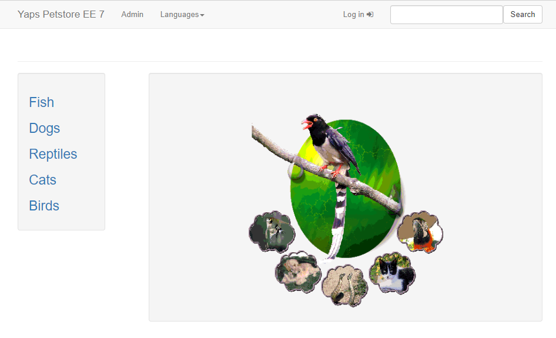

# Official Microsoft Sample

<!-- 
Guidelines on README format: https://review.docs.microsoft.com/help/onboard/admin/samples/concepts/readme-template?branch=master

Guidance on onboarding samples to docs.microsoft.com/samples: https://review.docs.microsoft.com/help/onboard/admin/samples/process/onboarding?branch=master

Taxonomies for products and languages: https://review.docs.microsoft.com/new-hope/information-architecture/metadata/taxonomies?branch=master
-->

This repo shows how to deploy your Wildfly applications onto App Service.

## Contents

Outline the file contents of the repository. It helps users navigate the codebase, build configuration and any related assets.

| File/folder       | Description                                |
|-------------------|--------------------------------------------|
| `src`             | Sample source code.                        |
| `.gitignore`      | Define what to ignore at commit time.      |
| `CHANGELOG.md`    | List of changes to the sample.             |
| `CONTRIBUTING.md` | Guidelines for contributing to the sample. |
| `README.md`       | This README file.                          |
| `LICENSE`         | The license for the sample.                |

## Prerequisites

You should have the following development tools installed on your local machine.

- [Docker](https://docs.docker.com/install/)
- [VS Code](https://code.visualstudio.com/)
- [Maven](https://maven.apache.org/download.cgi) (optional)

You will also need accounts for the following services

- [Microsoft Azure](https://azure.microsoft.com/)
- A container registry such as [DockerHub](https://hub.docker.com/) or [Azure Container Registry](https://azure.microsoft.com/services/container-registry/)

## Running the sample

### Build and test locally

<!-- 
Outline step-by-step instructions to execute the sample and see its output. Include steps for executing the sample from the IDE, starting specific services in the Azure portal or anything related to the overall launch of the code.
-->

First, build the image using using Docker.

```shell
docker build -t wildfly .
```

Next, run the container.

```shell
docker run wildfly 8080:80
```

TODO:
- You should see blank
- SSH into the container?

### Push to a container registry

Now that the container works locally, we will push the container to our registry so our Web App for Containers can pull it down in the next step. First, create a container registry on DockerHub or Azure Container Registry (ACR) by following either of the guides below.

- [Create a public DockerHub container registry](https://docs.docker.com/docker-hub/repos/)
- [Create a private Azure Container Registry](https://docs.microsoft.com/azure/container-registry/container-registry-get-started-portal)

Once your registry is created, log into the registry. The commands will differ slightly for DockerHub and ACR. If your registry is on DockerHub, log in with docker using the command below. Enter your username and password when prompted.

```shell
docker login
```

If your registry is on ACR, log in with the Azure CLI using the command below.

```shell
az acr login --name <your-registry-name>
```

Once you are logged in, push the image to your registry using docker. This command is the same for both DockerHub and ACR registries.

```shell
docker push <your-registry-name>/wildfly
```

### Deploy the container to Web App for Containers

If you have not already, create a Web App for Container using the Azure CLI. This command will create your Web App and configure it to use your Wildfly image. If you do not already have an App Service Plan, you can use `az appservice plan create` to create one.

```shell
az webapp create --name <your-desired-name> --plan <your-app-service-plan> -g <your-resource-group> -i <your-registry-name>/wildfly
```

Once the Web App has been deployed, open your browser to https://\<your-desired-name>.azurewebsites.net/. You will see [index.jsp](/tmp/index.jsp).


### Deploy an application on Wildfly

Now that the Wildfly runtime is functioning on App Service, we will deploy a sample WAR application onto Wildfly. First, build the application using Maven.

```shell
cd sample/agoncal-application-petstore-ee7
mvn clean install -DskipTests
```

Before deploying the built application, we need to configure our Web App to use the service's shared file storage. This will allow us to deploy artifacts using App Service's REST APIs. Your Web App already has an application setting named `WEBSITES_ENABLE_APP_SERVICE_STORAGE` with a value of `false`. Using the Azure Portal or CLI, change this setting's value to `true`.

Next, deploy the WAR file using App Service's REST APIs for deployment. For WAR applications, use [`/api/wardeploy/`](https://docs.microsoft.com/azure/app-service/deploy-zip#deploy-war-file). The username and password for the following command are from your Web App's publish profile.

```shell
curl -X Post -u <username> --data-binary @"target/applicationPetstore.war" https://<your-app-name>.scm.azurewebsites.net/api/wardeploy
```

If you are using PowerShell, there is a Azure commandlet for WAR deploy.

```shell
Publish-AzWebapp -ResourceGroupName <group-name> -Name <app-name> -ArchivePath "target\applicationPetstore.war"
```

Once the deployment completes, browse to your application and you will see the Pet Store application has replaced the default index.jsp from earlier.



## Next steps

Congratulations! You now have a Wildfly image in your container registry and running on App Service. Finally, you deployed a WAR application to the image.

### Deploy your own WAR application

In this sample we deployed an example WAR application. You will likely want to deploy your own apps onto Wildfly. To do so, you can use WAR deploy again with our own artifact.

### SSH into the image

The Dockerfile has been configured to allow SSH using App Service's native APIs. To SSH into the container, go the Azure Portal and select your Web App. Under **Development Tools** select the option for **SSH**.

### Build the application with the image

In this sample, we deployed our WAR application onto the running image using App Service's `/api/wardeploy/` endpoint. Alternatively, you can modify your Dockerfile to build your app and copy the WAR file. This will couple the container image with the WAR application(s).

### Change the Wildfly version

This sample uses Wildfly 14. You can use a different version of Wildfly by modifying the Dockerfile. See [the Wildfly downloads site](https://wildfly.org/downloads/) for a full list of available Wildfly versions.

## Key concepts

Please see the pages below for more information on the technologies used.

- [Wildfly](https://www.wildfly.org/)
- [Web App for Containers](https://azure.microsoft.com/services/app-service/containers/)

## Contributing

This project welcomes contributions and suggestions.  Most contributions require you to agree to a
Contributor License Agreement (CLA) declaring that you have the right to, and actually do, grant us
the rights to use your contribution. For details, visit https://cla.opensource.microsoft.com.

When you submit a pull request, a CLA bot will automatically determine whether you need to provide
a CLA and decorate the PR appropriately (e.g., status check, comment). Simply follow the instructions
provided by the bot. You will only need to do this once across all repos using our CLA.

This project has adopted the [Microsoft Open Source Code of Conduct](https://opensource.microsoft.com/codeofconduct/).
For more information see the [Code of Conduct FAQ](https://opensource.microsoft.com/codeofconduct/faq/) or
contact [opencode@microsoft.com](mailto:opencode@microsoft.com) with any additional questions or comments.
